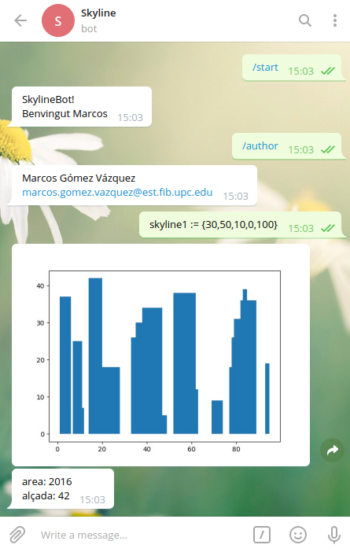

# Skyline

Chatbot de Telegram que permite la manipulación de Skylines via un intérprete.

## Presentación

Este chatbot permite al usuario interactuar con él, enviándole una serie de instrucciones para generar imágenes de skylines, en forma de gráficos de barras. Cualquier persona puede utilizarlo en modo usuario desde su dispositivo móvil, tablet, PC, etc. accediendo a este [link](http://t.me/skyline_marcos_bot)



## Ejecutar el bot

Simplemente correr el programa principal en Python:
```
python3 bot.py
```
Una vez esté activo, ya podemos interactuar con él por Telegram. Para empezar una conversación por primera vez es necesario acceder a este [link](http://t.me/skyline_marcos_bot). Después ya tendremos el bot en la lista de chats y podremos utilizarlo cuando queramos.

## Prerequisitos

Para poder utilizar el bot es necesario instalar, en el dispositivo donde se ejecute el código fuente, las siguientes librerías de Python:

```
antlr4-python3-runtime
matplotlib
pyhton-telegram-bot
```
El resto de librerías utilizadas pertenecen a [The Python Standard Library](https://docs.python.org/3/library/)

## Instrucciones de uso

### Comandos

El bot puede recibir una serie de comandos, los cuales empiezan por el carácter `/`, y son los siguientes:


  **/start   =>** inicia la conversación con el bot

  **/help    =>** muestra el manual de uso del bot

  **/author  =>** muestra el nombre y email del autor

  **/lst     =>** muestra los identificadores definidos y su correspondiente área

  **/clean   =>** borra todos los identificadores definidos en la conversación

  **/save id =>** guarda un skyline previamente definido, cuyo identificador es 'id'

  **/load id =>** carga un skyline previamente guardado, cuyo identificador es 'id'


### Instrucciones

Esta es la lista de instrucciones que el usuario puede realizar sobre algún skyline. Están ordenadas de mayor a menor prioridad.
Además se admite el uso de paréntesis como operador de máxima prioridad.

  **Refleja el skyline =>** -skyline

  **Intersección =>** skyline\*skyline

  **Replicación N veces seguidas =>** skyline\*N

  **Unión =>** skyline+skyline

  **Desplazamiento a la derecha N posiciones =>** skyline+N

  **Desplazamiento a la izquierda N posiciones =>** skyline-N

### Definición de skyline

Hay 3 maneras de definir un skyline:

**Simple =>** (xmin,h,xmax)

Genera un skyline de un único edificio con anchura xmin~xmax y altura h.

*xmin debe ser < xmax, y h debe ser > 0*

Ejemplo:

```
(10,30,25)
```

**Compuesto =>** [(xmin,h,xmax)...]

Genera un numero arbitrario de skylines simples. El skyline resultante es la unión de todos ellos.

Ejemplo:

```
[(0,10,3), (2,5,10), (20,3,25), (1,20,2)]
```

**Aleatorio =>** {n,h,w,xmin,xmax}

Construye un skyline de n edificios, cada uno de ellos con una altura aleatoria entre 0 i h, con una anchura aleatoria entre 1 i w, y una posición de inicio y de final aleatoria entre xmin y xmax.

*h y n deben ser >= 0, xmin debe ser < xmax, y w debe ser <= xmax-xmin*

Ejemplo:

```
{50,100,20,0,300}
```

### Asignación de skylines
Se pueden asignar identificadores a skylines, mediante el operador `:=`

Ejemplos:

```
a:={10,20,5,0,50}
b:=[(0,10,3), (2,5,10), (20,3,25), (1,20,2)]
c:=(a+50)*b
a:=(-c) //en este caso, el valor de 'a' se pierde y es reemplazado por el de '-c'
```

## Algunos aspectos técnicos

### Implementación del skyline

Cuando nos preguntamos cuál es la representación de un [skyline](skyline.py), que es un conjunto de edificios, y vemos su implementacion, nos damos cuenta de que en realidad el skyline está definido como una lista de pares [x,h], ordenada crecientemente por las 'x'. De esta manera la única información que se necesita saber sobre el skyline son los cambios de altura: Dónde hay un cambio de altura (x), y cuál es la nueva altura (h).

Esta implementación es realmente praćtica ya que a la hora de realizar la unión o intersección de dos skylines simplemente hay que "fusionarlos", actualizar alturas que se ven afectadas por el otro skyline, añadir nuevas alturas del otro skyline o eliminar alturas que se ven opacadas por otro skyline. También es realmente práctico para definir skylines random, los cuales se crean como la unión de edificios simples consecutivamente (aunque mediante un método a parte para la unión de un skyline con un edificio simple, que proporciona mejor rendimiento que la unión normal).

A la hora de calcular el área del skyline nos basta con ir acumulando sub-áreas de rectánculos comprimidos en cada cambio de altura del skyline. Y para calcular su altura simplemente hay que buscar el punto más alto de todos los cambios de altura.

### Intérprete

Para diseñar el intérprete de los mensajes que el usuario introduce al bot, se ha creado una [gramática](cl/Skyline.g) muy simple en formato `antlr4`, que analiza el contenido léxico y sintáctico de los mensajes mediante un [lexer](cl/SkylineLexer.py) y un [parser](cl/SkylineParser.py), y finalmente el [visitor](cl/SkylineVisitor.py) recorre el árbol de sintaxis abstracta para obtener un resultado en función del contenido del mensaje.

### Guardar/cargar skylines

Cada usuario puede guardar o cargar sus propios skylines. Esto permite recuperar skylines cuando se limpia la lista de identificadores, o cuando se reinicia el bot. Aunque varios usuarios guarden un skyline con el mismo identificador estos no se solaparán, ya que cada usuario tendrá un directorio con su chat_id como nombre, y en el que se almacenarán los skylines que guarde.

Cabe mencionar que no se pueden cargar skylines no existentes, ni guardar skylines no definidos con un identificador. Además, si hay guardado un skyline y se guarda otro con el mismo identificador, el antiguo será reemplazado.

## Built With

* [Python](https://www.python.org/)

## Autor

* **Marcos Gómez Vázquez** - *Facultad de Informática de Barcelona, UPC*
